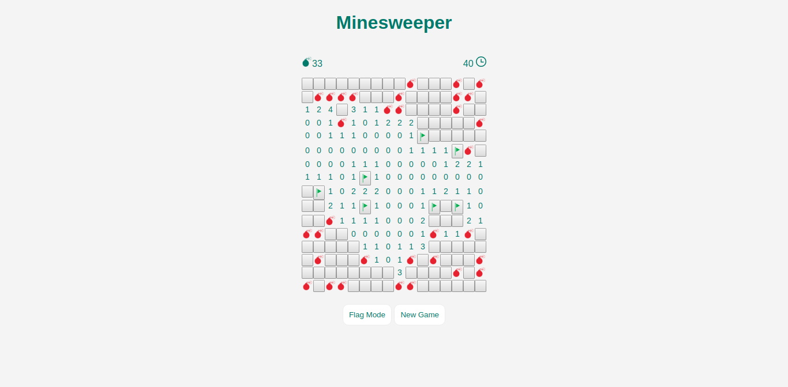

# MinesweeperNg

This project is a simple minesweeper coded with Angular 2

This project was generated with [Angular CLI](https://github.com/angular/angular-cli) version 1.0.0-beta.32.3.

### Installation

Run `npm install`

### Development server

Run `ng serve` for a dev server. Navigate to `http://localhost:4200/`. The app will automatically reload if you change any of the source files.

### Screenshot

### TODO

* Add other designs
* Save current game
* Add tests
